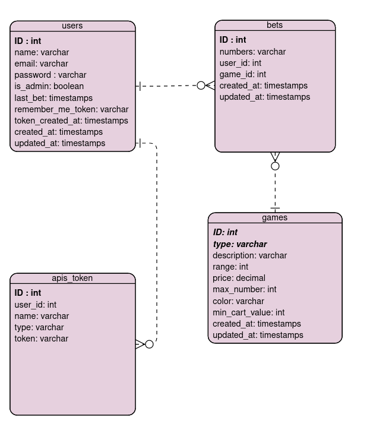
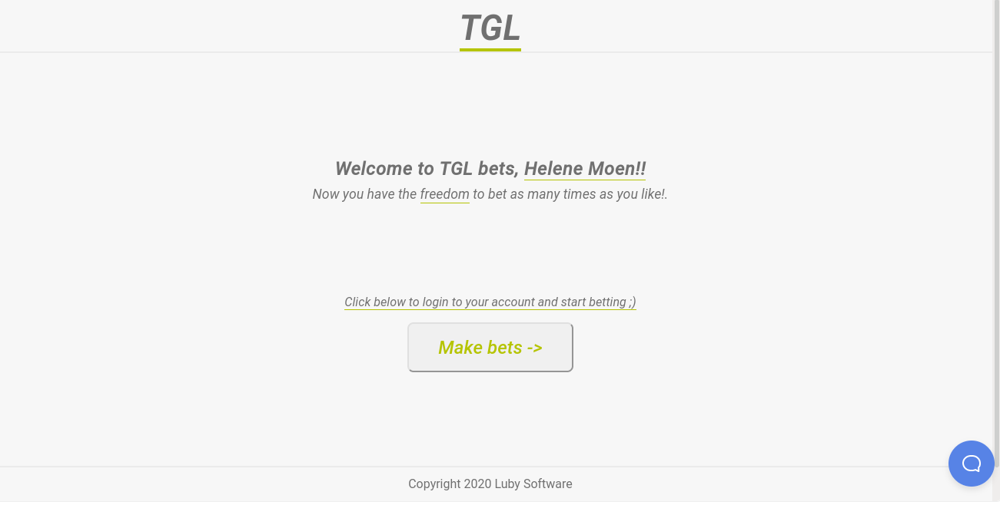
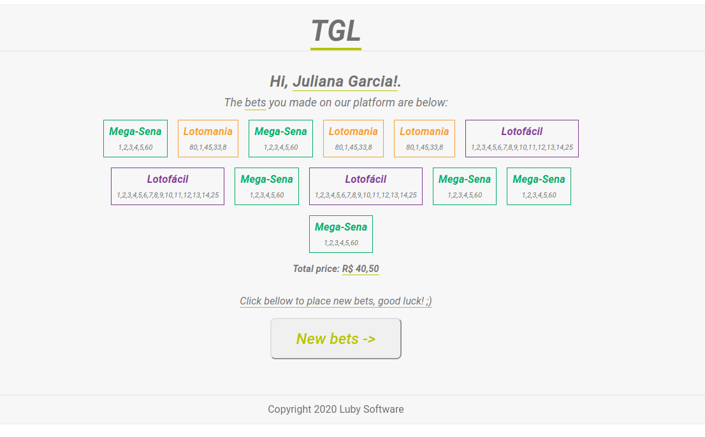
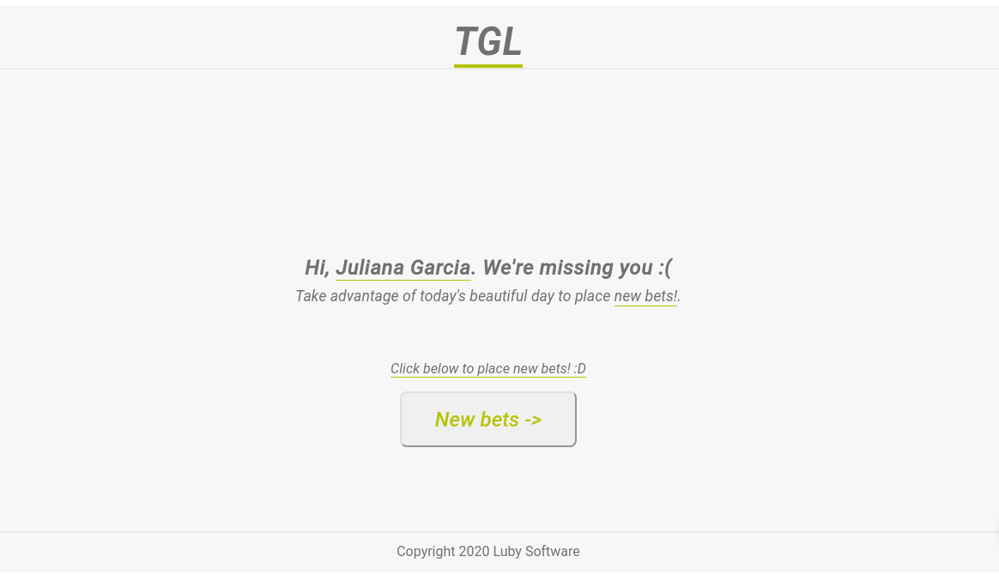
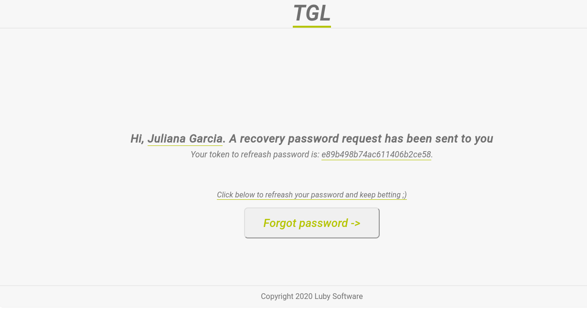

# TGL API

## How to run the project?

```
npm i
```

```
npm run build
```

```
In this .env file enter the database and email service data
```

```
docker-compose up
```

```
Now everything is running!
```

## Database logic diagram



## About the project

- The API has two types of users, common users and administrators.

- Both administrators and users must be authenticated to perform their duties.

- The function of ADMS is to check all users, promote, demote new administrators and create and manage lottery games

- Users can create and manage their bets, change their data and delete the account

- Routes to view games, create new users and "forgot my password" do not require authentication

- A scheduler was created where every 9:00 of each day an email will be sent inviting users who have not bet in the last seven days to bet


## Templates de email

- When the user is created, a welcome email is sent:

  

- When a user places a new bet, an email is sent showing that he has placed a bet and the total value of the bets

  

- When a user has not bet in the last seven days, every 9:00 AM an email will be sent inviting them to bet.

  

- When the user requests a password recovery

  

## Informações adicionais

- API developed in LabLuby by LubySofware!
