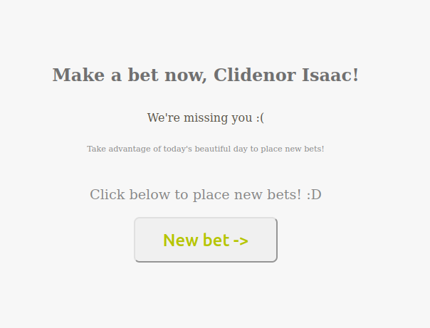

# TGL API

## Como rodar essa API?

```
npm i
```

```
npm run build
```

```
touch .env

Nesse arquivo .env insira os dados do banco de dados e do serviço de email
```

```
docker-compose up
```

## Diagrama lógico do banco de dados


## Sobre o projeto

- A API possui dois tipos de usuários, os usuários comuns e os administradores.

- Tanto os administradores, quanto os usuários devem estar autenticados para realizarem suas devidas funções.

- A função dos ADMS são de verificar todos os usuários, promover, despromover novos administradores e criar e gerenciar os jogos da loteria

- Os usuários podem criar e administrar suas apostas, alterar seus dados e deletar a conta

- As rotas para visualizar os jogos, criar novos usuários e de "esqueci minha senha" não necessitam de autenticação

- Foi criado um scheduler onde a cada 9:00 de cada dia será enviado um email convidando usuários que não apostaram nos últimos sete dias a apostarem

## Templates de email

- Quando o usuário é criado, é enviado um email de boas vindas:

  

- Quando um usuário realiza uma nova aposta, é enviado um email mostando que ele realizou uma aposta e o valor total das apostas

  

- Quando um usuário não apostou nos últimos sete dias, todas as 9:00 AM será enviado um email convidando para apostar.

  

## Testes

- Para rodar os testes decidi criar um container do docker com as seguintes características:

```
version "3"

services:
 db_test:
   container_name: postgres_db_test
   image: 'postgres:latest'
   restart: always
   environment:
     POSTGRES_PASSWORD: test
     POSTGRES_USER: test
     POSTGRES_DB: test
   ports:
     - "5432:5432"
```

- Crie um arquivo .env.testing e insira as seguintes variáveis:

```
PG_USER=test
PG_PASSWORD=test
PG_DB_NAME=test
```

## Informações adicionais

- API desenvolvida no LabLuby da LubySofware!
